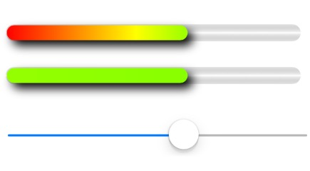

# ColorProgressView

ColorProgressView implement for iOS in Objective-C

## Usage
Add the following line to your application:

    - (void)viewDidLoad {
        [super viewDidLoad];

        ColorProgressView *progress = [[ColorProgressView alloc]
                                       initWithFrame:CGRectMake(18, 300, 284, 16)];
        [self.view addSubview:progress];
        _progress = progress;
    }

    - (IBAction)valueChanged:(UISlider *)sender {
        _progress.progress = sender.value;
    }

## Supported OS
Tested in iOS 6.x, 7.x, 8.x, 9.x device and simulator

## LICENSE
Released in [MIT License](http://opensource.org/licenses/mit-license.php)
